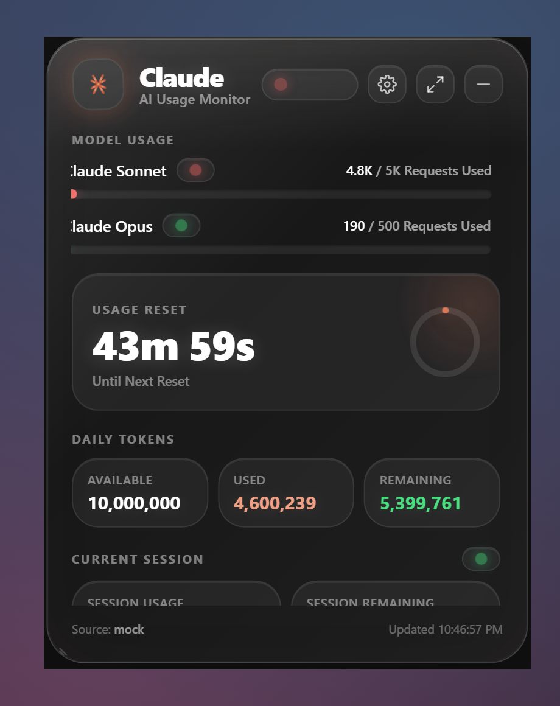
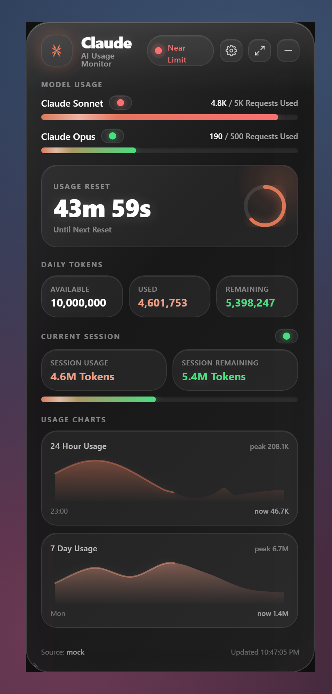

<p align="center">
  
</p>

<h1 align="center">Claude Glass Widget</h1>

<p align="center">
  A premium <b>floating glass desktop HUD</b> that keeps your Claude AI usage
  permanently on your desktop — requests, daily tokens, the live reset countdown,
  the current session and Apple-style usage charts — in an always-on-top,
  transparent, VisionOS-inspired panel.
</p>

<p align="center"><i>Not a dashboard. A desktop companion. It feels like Claude is always there.</i></p>

<p align="center">
  
  &nbsp;&nbsp;
  
</p>

Built with **Tauri v2 + React + TypeScript + TailwindCSS + Framer Motion +
Zustand**. Data comes from [`ccusage`](https://github.com/ryoppippi/ccusage),
read locally on each user's machine.

---

## ⬇️ Download & install (for everyone)

You don't need to build anything — grab the installer and run it:

1. Go to the [**Releases**](../../releases) page and download the latest
   **`Claude Glass Widget_x.y.z_x64-setup.exe`** (or the `.msi`).
2. Run it. The widget appears in the **top-right corner** and adds a **tray icon**.
3. **One prerequisite:** install **[Node.js](https://nodejs.org)** (LTS). The
   widget uses [`ccusage`](https://github.com/ryoppippi/ccusage) to read your
   *own* local Claude usage; if it isn't installed globally the app falls back to
   `npx ccusage@latest` automatically — that just needs Node on your PATH.
   *(WebView2 is already on Windows 10/11.)*
4. Use Claude Code at least once so usage logs exist, then hit **Refresh**.

That's it — it reads **your** machine's local Claude logs, so it works the same
for anyone who installs it. No accounts, no sign-in, nothing leaves your computer.

> Tip: enable **Launch on Startup** in Settings and it runs 24/7, always pinned
> top-right.

---

## ✨ Features

- **Ultra-premium glassmorphism** — 30px backdrop blur, layered specular
  highlight over an adjustable dark tint, soft animated edge glow, 32px radius,
  big ambient shadow. Stays readable over wallpaper, browsers, VS Code or
  windowed games.
- **Frameless · transparent · always-on-top · hidden from taskbar.**
- **Draggable & resizable**, remembers its position between launches, snaps to
  the top-right on first run.
- **Click-through mode** so it can become a passive overlay.
- **Launch on startup** (Windows / macOS login item).
- **Live data** from ccusage, auto-refreshed every minute (configurable) and
  cached between refreshes.
- **Per-model progress** (Claude Sonnet / Claude Opus) with animated bars.
- **Live reset countdown** updated every second, with an elapsed-window ring.
- **Daily token budget** — Available / Used / Remaining.
- **Current session** — usage / remaining.
- **Smooth curved mini-charts** — 24-hour and 7-day usage (real Catmull-Rom
  splines, not bar charts).
- **Animated status** — 🟢 Healthy · 🟡 Approaching Limit · 🔴 Near Limit.
- **Expandable panel** (650×800) with Overview, Daily, Weekly, Monthly,
  Sessions and Resets breakdowns.
- **System tray** — Show / Hide / Refresh / Settings / Quit, plus left-click to
  toggle.
- **Settings** — Always on Top, Click-Through, Launch on Startup, Transparency,
  Refresh Interval.
- **Mobile-sync ready** — a clean `UsageProvider` / `SyncProvider` abstraction
  so an Android app, Samsung Watch face or web dashboard can plug in later.

---

## 🖼️ What it looks like

| Floating HUD | Full view (session + charts) |
|:---:|:---:|
|  |  |

The header controls (right side): **status pill**, **settings ⚙**, **expand ⤢**,
and **minimize —** (hides to tray). Drag the header to move it; drag a bottom
corner grip to resize.

---

## 🚀 Build from source

### Prerequisites

| Requirement | Notes |
|-------------|-------|
| **Node.js ≥ 18** | for the React frontend |
| **Rust (stable) + Cargo** | install via <https://rustup.rs> — required to compile the Tauri backend |
| **WebView2** | already present on Windows 11; the installer bootstraps it otherwise |
| **ccusage** | the data source: `npm install -g ccusage` |

> On Windows you also need the **Microsoft C++ Build Tools** (Desktop
> development with C++). See [INSTALL.md](INSTALL.md) for the full checklist.

### Run in development

```bash
npm install
npm run app:dev      # launches the real desktop widget (Tauri + Vite)
```

Just want to preview the UI in a browser (no Rust needed)? It falls back to a
realistic **mock data** provider:

```bash
npm run dev          # http://localhost:1420
```

### Build a distributable installer

```bash
npm run app:build    # produces NSIS + MSI installers in src-tauri/target/release/bundle
```

---

## 🧩 Data source: ccusage

The widget shells out to the [`ccusage`](https://github.com/ryoppippi/ccusage)
CLI (falling back to `npx ccusage@latest`), parses its JSON and normalizes it.

- It runs `ccusage daily --json` and `ccusage blocks --json`.
- `daily` drives the token budget and the day/week/month breakdowns.
- `blocks` (Claude's 5-hour rolling windows) drives the **session**, the **reset
  countdown**, and the session/reset history.

If ccusage isn't installed, the widget shows a friendly
**"No Claude Usage Data Available → Install ccusage"** screen with a retry.

### Tuning limits

ccusage reports tokens, not your plan's request/window ceilings, so those are
configurable via environment variables (sensible defaults shown):

| Variable | Default | Meaning |
|----------|---------|---------|
| `CLAUDE_DAILY_TOKEN_LIMIT` | `10000000` | "Available Today" ceiling |
| `CLAUDE_SESSION_TOKEN_LIMIT` | `10000000` | session token ceiling |
| `CLAUDE_SONNET_REQUEST_LIMIT` | `5000` | Sonnet request ceiling |
| `CLAUDE_OPUS_REQUEST_LIMIT` | `500` | Opus request ceiling |
| `CLAUDE_AVG_TOKENS_PER_REQUEST` | `1100` | used to estimate request counts |

> Request counts are **estimated** from token usage because ccusage doesn't
> expose per-message counts; tune `CLAUDE_AVG_TOKENS_PER_REQUEST` to taste.

---

## 🏗️ Architecture

```
src/
├─ types/usage.ts          Canonical UsageSnapshot model (the only shape the UI knows)
├─ lib/
│  ├─ providers/           ── Abstraction layer ──
│  │  ├─ types.ts          UsageProvider + SyncProvider interfaces
│  │  ├─ ccusage.ts        Real provider (talks to the Rust backend)
│  │  ├─ mock.ts           Realistic demo provider (browser / fallback)
│  │  ├─ SyncProvider.ts   No-op cloud-sync scaffold (mobile/watch/web ready)
│  │  └─ index.ts          createUsageProvider() picks by runtime
│  ├─ tauri.ts             Browser-safe wrappers around Tauri APIs
│  └─ utils.ts             Formatting, status math, helpers
├─ store/                  Zustand: usageStore · settingsStore · uiStore
├─ hooks/                  useCountdown · useUsagePolling · useWindowControls
├─ components/             GlassCard, Header, UsageSection, ResetSection,
│                          DailyTokenSection, SessionSection, MiniChart,
│                          StatusIndicator, ExpandedPanel, Settings, NoData …
└─ App.tsx                 Composition root

src-tauri/
├─ src/
│  ├─ lib.rs               App setup, plugins, tray, window-event wiring
│  ├─ commands.rs          IPC commands (usage, window controls)
│  ├─ ccusage.rs           Runs + parses ccusage → UsageSnapshot JSON
│  ├─ tray.rs              System tray icon + menu
│  └─ window.rs            Top-right placement + position persistence
├─ capabilities/default.json   Tauri v2 permissions
├─ tauri.conf.json         Window / bundle configuration
└─ Cargo.toml
```

**Why the abstraction layer?** The UI renders a single `UsageSnapshot` and never
touches a data source directly. Today the source is ccusage. Tomorrow, drop in a
`RemoteUsageProvider` + a real `SyncProvider` (see `SyncProvider.ts`) and the
same data flows to an Android app, a Samsung Watch face, or a web dashboard with
**zero UI changes**.

---

## ⚙️ Settings

Open via the gear icon or the tray. All settings persist locally.

- **Always On Top** — keep above every window.
- **Click-Through Mode** — clicks pass through to apps behind (toggle back off
  from the tray).
- **Launch On Startup** — register/unregister the OS login item.
- **Transparency Level** — 30%–100% glass opacity.
- **Refresh Interval** — 15s–300s.

---

## 🎯 Performance targets

| Metric | Target | How |
|--------|--------|-----|
| Idle CPU | < 1% | one 1s countdown tick + one poll/min; no idle animations loop on the data path |
| Memory | < 100 MB | Tauri uses the OS WebView (no bundled Chromium) |
| Cold start | < 2 s | `opt-level=s`, LTO, single codegen unit, stripped binary |

---

## 🛣️ Roadmap (mobile sync)

The `SyncProvider` interface is final and wired through the store; only the
implementation is stubbed. Planned clients:

- 📱 Android app
- ⌚ Samsung Watch face
- 🌐 Web dashboard

---

## 📦 Scripts

| Command | Description |
|---------|-------------|
| `npm run dev` | Vite dev server (browser, mock data) |
| `npm run app:dev` | Full Tauri desktop app in dev |
| `npm run build` | Type-check + build the web assets |
| `npm run app:build` | Build native installers |
| `npm run typecheck` | `tsc --noEmit` |
| `node scripts/generate-icons.mjs` | Regenerate all app/tray icons |

---

## 📄 License

MIT — see [LICENSE](LICENSE).
